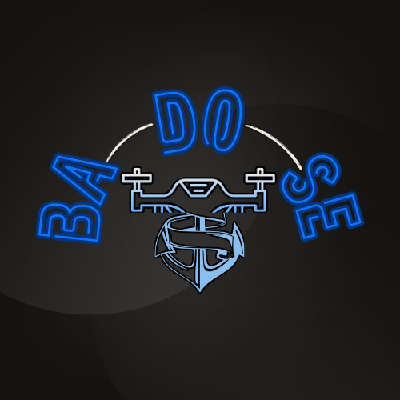

# BADOSE: Boat and Drone Ocean Simulated Environment

## About

**BADOSE** is an open-source simulator built with the Unity Engine and supported by a ROS 2 connection interface. The main aim of this simulator is to provide an environment capable of handling both drones and boats/ships along with the physics involving ocean turbulence and winds. This helps in creating control algorithms and advanced interactions between ships and drones, which can be deployed on real hardware for testing and deployment.
Features of Version 1.0 (Release Version)

1) **Multi-Agent Simulation:** Control and simulate up to 10 drones and 10 ships.
2) **Realistic Ocean Simulation:** Utilizes Unity’s water system in HDRP for realistic ocean dynamics.
3) **ROS 2 Integration:** Separate topics and nodes facilitate communication of required simulation parameters. This uses ROS2Unity repository for connection.
4) **Wind Simulation:** Allows creation and advanced wind interactions through topics.
5) **Camera Simulation:** Provides data streaming for drones.
6) **Cross Compatibility:** Compatible with Windows and Linux (not tested on Windows yet).

## Installation

This version is built and tested on Ubuntu 22.04.
**A) Unity**
Case 1: Using the Simulator without Changes

If you only want to use the simulator without making changes to the base version, download the official build version from the following drive link:
[Official Build Version](https://drive.google.com/drive/u/2/folders/1cU50BhWmNY6vALz2z-nXbKpTKHGF8OIc)

Case 2: Customizing the Simulation
1) Download Unity from [here](https://unity.com/download). This version was built on Version 2022.3.30f1.
2) Download the asset and required folders from the following Google Drive folder:
[Google Drive Sim Files](https://drive.google.com/drive/u/2/folders/10jisRtg-oJRz-YgHiIASLJAiSxyh5WBu)
3) Open the folder you downloaded in Unity Hub or create a new project and import the files manually.

**B) ROS 2**

For this version, ROS 2 Humble has been used. Follow the steps on the [ROS 2 Installation page](https://docs.ros.org/en/humble/Installation.html) to install it on your desktop.

## Usage

1) Check the presentation in the GitHub repository to find details about ROS 2 topics and message formats.
2) Open the BUILD01.x86_64 (exe) program to access the simulation setup main menu.
3) Select the number of drones, boats, and other relevant details.
4) Press the "Start Sim" button to enter the simulation.
5) Run ROS 2 scripts to subscribe or publish to the desired topic and control the simulation.

## Contributing to the Source Code

The GitHub repository for this simulator contains only Unity and Python scripts. Any changes or additions should be committed to the branch after raising an issue or request.

To change Unity assets or other data, please request permission for uploading the content to drive either by emailing (mandred.tech@gmail.com) or by raising an issue on the GitHub repository.

## Features and Improvements for Future Versions

1) **Custom Object Import:** Capability to import custom objects and arrange them in the world.
2) **Tagging and Imaging:** Attaching tags or images to ships/boats, ground, and walls for navigation and object detection purposes.
3) **Optimization:** Current version requires a powerful system to run all the drones with camera streaming. Future versions will aim to improve the efficiency of camera streaming and overall optimization. (Currently, running even two or three drones with cameras requires a very powerful computer.)
4) **Additional Sensor Modules:** Simulation of more sensor modules like Li-DAR, actuators, etc.
